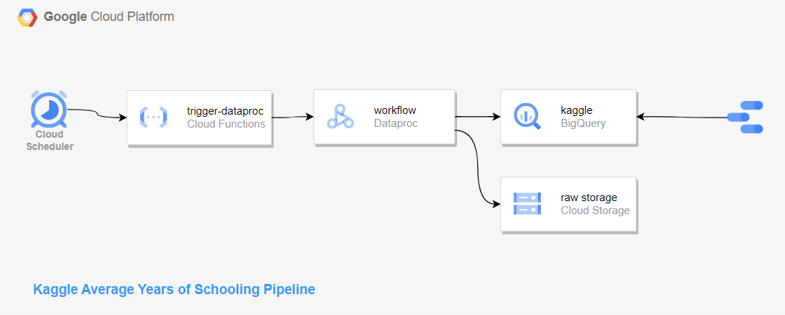
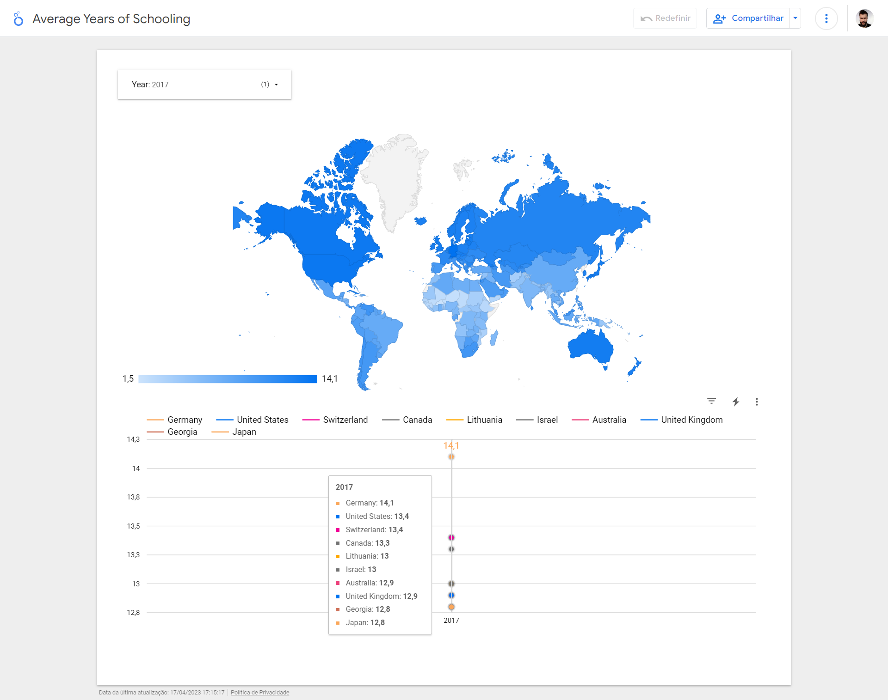
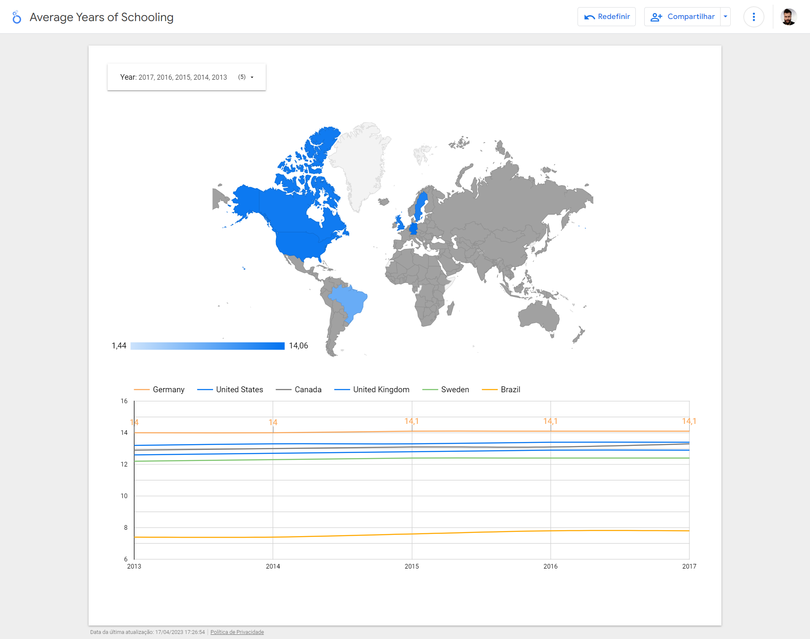

# Data Engineer Zoomcamp Final Project

This project is a data engineering pipeline with data about education from Kaggle dataset.

## Dataset

The [dataset](https://www.kaggle.com/datasets/fredericksalazar/average-years-of-schooling-since-1870-2017) contains information about the average years of schooling sonce 1870 to 2017 in countries around the world.

### Pipeline

### Report

Selecting a year from the filter.

Selecting multiple years from the filter and some countries from the graph.

# Achive steps

https://github.com/DataTalksClub/data-engineering-zoomcamp/blob/main/week_7_project/README.md
